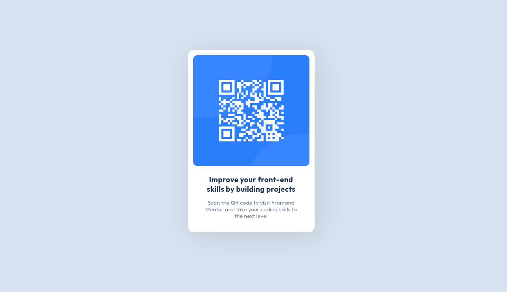

# Frontend Mentor - QR code component solution

This is a solution to the [QR code component challenge on Frontend Mentor](https://www.frontendmentor.io/challenges/qr-code-component-iux_sIO_H). Frontend Mentor challenges help you improve your coding skills by building realistic projects. 

## Table of contents

- [Screenshot](#screenshot)
- [Links](#links)
- [Built with](#built-with)
- [Useful resources](#useful-resources)
- [Author](#author)

### Screenshot

### Links
- Solution URL: https://www.frontendmentor.io/solutions/qr-code-component-replication-using-html-and-css-dCEuZA8s5
- Live Site URL: https://kiruanime2003.github.io/qr-code-component-main

### Built with
- Semantic HTML5 markup
- SCSS
- Vscode

### Useful resources
- [Freecodecamp](https://www.freecodecamp.org/news/how-to-center-anything-with-css-align-a-div-text-and-more/) - This helped me for centering the div element on the page. 
- [Stack overflow](https://stackoverflow.com/questions/1147877/how-to-word-wrap-text-in-html) - This helped me to know how to use word wrap property in css.

## Author
- Website - [Kiruthiga K](https://kiruanime2003.gitlab.io)
- Blog - [Kiruthiga K](https://kiruanime2003.wordpress.com)
- Frontend Mentor - [@kiruanime2003](https://www.frontendmentor.io/profile/kiruanime2003)
